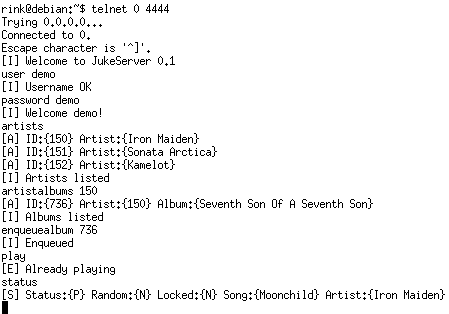

# IL/Jukebox

Back in the day when I signed up as an Dispuut Interlink member, there was this quite old Jukebox-like system called _mserv_. mserv relied on having to scan all music upon load, which made it terribly painful to start, especially as we experienced quite a bit of crashes. Futhermore, its concept of authentication was quite primitive, which resulted in having to grant people special rights in order to manage the beast.

As I really felt as if we should have a system better taylored to Interlink's members, I took over the project and coded a Jukebox system from scratch, IL/Jukebox. It is released using the GPL.

Later, Interlink switched to a new system, _herrie_, which led me to abandon the project. The entire CVS repository is imported, and can be browsed. Finally, a release and a FreeBSD port are available:

## Features

Among IL/Jukebox's features are:

  * Database driven - all your track information is stored in a SQL database, with support for MySQL, PostgreSQL and SQLite
  * Portable - Known to work on FreeBSD, Linux and Solaris
  * Advanced authentication - can authenticate users based on SQL tables, LDAP directories; in the order you prefer.
  * File format agnostic - it relies on backends to play music, and only needs special hooks for scanning the songs
  * Network driven - All commands passed to the Jukebox are done using a standard TCP socket
  * PHP frontend - Control your jukebox from your browser

And probably much more...  the 1.0 release has been used at Interlink for years without any problems.

## lib++

During development of Frommel, I found that a lot of low-level network functionality used there was also needed in IL/Jukebox. I decided to create a seperate library, [libplusplus](https://github.com/zhmu/libplusplus), which contains this functionality. You will need lib++ in order to build IL/Jukebox.

## Screenshot

## Downloads

  * [Version 1.0](releases/jukebox-1.0.tar.gz) (132KB)
  * [FreeBSD port](releases/jukebox-port.tar.gz) (2KB)
